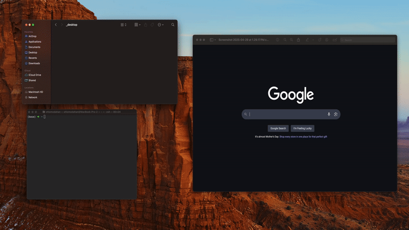

# cleanshot 📸

[](https://badge.fury.io/py/cleanshot)
[](https://opensource.org/licenses/MIT)

Cleanshot monitors your macOS Screenshots folder and automatically renames screenshots using OpenAI.



## 🔧 Installation

```bash
pip install cleanshot
```

## 🎮 Usage

#### Start cleanshot

```bash
cleanshot
```

#### Stop cleanshot

```bash
cleanshot stop
```

#### View help docs

```bash
cleanshot --help
```

## ⚙️ Settings

### **Supported LLM Providers:**

- OpenAI

You can update your API keys and provider settings by running:

```bash
cleanshot --setup
```

### OpenAI

To use OpenAI, you need an OpenAI account and a subscription. You can create an API key on [this page](https://platform.openai.com/settings/organization/api-keys).

## 🤝 Contributing

Contributions are welcome! Feel free to open issues or submit pull requests.

## 📄 License

This project is licensed under the MIT License - see the [LICENSE](LICENSE) file for details.
